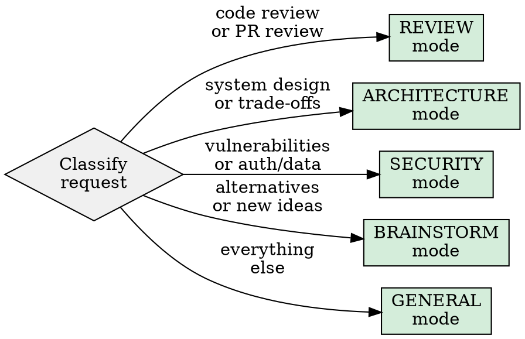

# Tri-Model Advisor (CCG)

```
NEVER SYNTHESIZE WITHOUT READING BOTH ADVISOR OUTPUTS IN FULL.
NEVER SKIP CONFLICT IDENTIFICATION — AGREEMENT WITHOUT TENSION IS SUSPICIOUSLY SHALLOW.
NEVER EMBED FULL FILES IN PROMPTS — ADVISORS CAN READ THE WORKING DIRECTORY.
```

Claude orchestrates a Mixture-of-Agents pattern: Codex and Gemini run as parallel proposers, Claude acts as the aggregator/synthesizer. An optional debate round lets advisors respond to each other's critiques.

## When to Use

- User explicitly invokes `/ccg`
- Architecture + UX/DX review needed in one pass
- Cross-validation where a single perspective has blind spots
- Code review from multiple angles (correctness vs. design vs. alternatives)
- High-stakes decisions where "are we sure?" matters

## Requirements

- **Codex CLI**: `codex` in PATH (`npm install -g @openai/codex`)
- **Gemini CLI**: `gemini` in PATH (`npm install -g @google/gemini-cli`)

## Mode Selection

Classify the request before decomposing. The mode determines how prompts are specialized.



| Mode | Codex Focus | Gemini Focus | Special |
|---|---|---|---|
| **REVIEW** | Correctness, bugs, logic errors, test gaps | Readability, DX, naming, patterns, alternatives | Use `codex review` subcommand |
| **ARCHITECTURE** | Scalability, data flow, failure modes, performance | Trade-offs, prior art, migration paths, simplicity | Ask for ASCII diagrams |
| **SECURITY** | OWASP top 10, injection, auth bypass, data exposure | Threat modeling, attack surface, compliance, docs | Both focus security |
| **BRAINSTORM** | Feasibility analysis, implementation cost, risks | Creative alternatives, UX angles, novel approaches | Wider temperature |
| **GENERAL** | Architecture, correctness, backend, performance | Alternatives, patterns, DX, documentation | Default split |

## Execution Protocol

### Step 1: Verify and Classify

```bash
codex --version 2>/dev/null && echo "codex: OK" || echo "codex: MISSING"
gemini --version 2>/dev/null && echo "gemini: OK" || echo "gemini: MISSING"
```

Classify the request into a mode. State the mode explicitly before proceeding.

### Step 2: Gather Context

Identify what the advisors need to examine:

- **File paths** they should read (both CLIs can read files from the working directory)
- **Specific line ranges** or functions to focus on
- **Project context**: language, framework, constraints
- **The decision or question** being asked

REQUIRED INTEGRATION: If this is a debugging task, use `superpowers:systematic-debugging` first to identify the root cause, then invoke CCG for solution validation. If this is a brainstorming task, consider whether `superpowers:brainstorming` should run first to generate the option space.

### Step 3: Compose Advisor Prompts

Each prompt must be **self-contained** — the advisors have no access to your conversation history.

Every advisor prompt MUST include:
1. **Role assignment**: what expert persona the advisor should adopt
2. **Context**: project info, relevant file paths to read, constraints
3. **Task**: exactly what to analyze or decide
4. **Output format**: structured format you expect back (bullets, table, trade-offs)
5. **Anti-slop directive**: "Be specific and concrete. No generic advice. Reference actual code and line numbers."

Write prompts to temp files to avoid shell escaping issues:

```bash
cat > /tmp/ccg-codex-prompt.md << 'CODEX_EOF'
<prompt content>
CODEX_EOF

cat > /tmp/ccg-gemini-prompt.md << 'GEMINI_EOF'
<prompt content>
GEMINI_EOF
```

See `tri-model-advisor/advisor-prompts.md` for role templates per mode.

### Step 4: Invoke Advisors in Parallel

Run both simultaneously. Capture output to files for reliable reading.

**Standard invocation:**
```bash
env -u RUST_LOG -u RUST_BACKTRACE -u RUST_LIB_BACKTRACE \
  codex exec --full-auto -m "${CCG_CODEX_MODEL:-o4-mini}" \
  "$(cat /tmp/ccg-codex-prompt.md)" \
  > /tmp/ccg-codex-out.txt 2>&1 &
CODEX_PID=$!

gemini -p "$(cat /tmp/ccg-gemini-prompt.md)" \
  --approval-mode=yolo -m "${CCG_GEMINI_MODEL:-pro}" \
  --output-format text \
  > /tmp/ccg-gemini-out.txt 2>&1 &
GEMINI_PID=$!

wait $CODEX_PID 2>/dev/null; CODEX_EXIT=$?
wait $GEMINI_PID 2>/dev/null; GEMINI_EXIT=$?
echo "Codex exit: $CODEX_EXIT | Gemini exit: $GEMINI_EXIT"
```

**REVIEW mode** — use Codex's dedicated review subcommand:
```bash
codex review --uncommitted > /tmp/ccg-codex-out.txt 2>&1 &
# or: codex review --base main
```

**Fallback**: If `--full-auto` fails due to sandbox restrictions, retry Codex with `--dangerously-bypass-approvals-and-sandbox`.

### Step 5: Validate Output

Read both outputs. Before synthesizing, validate:

```bash
cat /tmp/ccg-codex-out.txt
cat /tmp/ccg-gemini-out.txt
```

| Condition | Action |
|---|---|
| Output is empty | Mark advisor as FAILED, note in synthesis |
| Output is only error/stack trace | Mark as FAILED, include error context |
| Output is truncated (mid-sentence) | Mark as PARTIAL, use what's available |
| Output is generic/unhelpful slop | Mark as LOW-QUALITY, reduce its weight |
| Output is substantive | Mark as OK, full weight |

### Step 6: Persist Artifacts

```bash
mkdir -p .ccg/artifacts
TIMESTAMP=$(date -u +"%Y%m%d-%H%M%S")
```

Write artifacts to `.ccg/artifacts/<provider>-<timestamp>.md`. See format in `tri-model-advisor/artifact-format.md`.

### Step 7: Synthesize (Aggregator Phase)

This is the core of the MoA pattern. Claude acts as the aggregator.

**Process:**
1. Read both advisor outputs completely — do not skim
2. Form your own independent analysis (you already have conversation context the advisors lacked)
3. Identify every point where perspectives align or diverge
4. For each divergence, determine WHY they disagree (different assumptions? different priorities? one has context the other lacks?)
5. Produce a unified response

**Output format:**

> ### Mode: [REVIEW|ARCHITECTURE|SECURITY|BRAINSTORM|GENERAL]
>
> ### Agreed
> High-confidence recommendations where all three perspectives align.
> Each item as: `recommendation — [Claude, Codex, Gemini all agree]`
>
> ### Conflicting
> For each disagreement:
> - **Point**: what the disagreement is about
> - **Claude**: position + reasoning
> - **Codex**: position + reasoning
> - **Gemini**: position + reasoning
> - **Resolution**: which perspective wins and why
>
> ### Final Direction
> The chosen path with explicit rationale. Reference specific advisor arguments.
>
> ### Action Checklist
> Ordered, immediately actionable steps. Each item concrete enough to execute.
>
> ### Confidence & Caveats
> - Overall confidence: HIGH / MEDIUM / LOW
> - Which advisor was most relevant for this specific request
> - Missing perspectives, timeouts, quality issues

### Step 8: Debate Round (Optional)

Trigger a debate round when:
- Advisors strongly disagree on a critical point
- You are unsure which perspective is correct
- The user explicitly asks for deeper analysis

**Protocol**: Send each advisor the other's key argument and ask them to respond:

```bash
# Write debate prompts including the other advisor's position
cat > /tmp/ccg-codex-debate.md << 'DEBATE_EOF'
A peer reviewer (Gemini) analyzed the same problem and concluded:
<paste Gemini's key argument>

You previously recommended:
<paste Codex's key argument>

Do you still hold your position? If so, provide stronger evidence.
If the peer raises valid points, revise your recommendation.
Be specific — reference code and concrete trade-offs.
DEBATE_EOF
```

Run the debate prompts the same way as Step 4. Then re-synthesize with the enriched context.

**Limit**: Maximum 1 debate round. More rounds do not reliably improve accuracy (per ICLR 2025 MAD research). The value is in surfacing stronger evidence, not in reaching forced consensus.

### Step 9: Cleanup

```bash
rm -f /tmp/ccg-codex-prompt.md /tmp/ccg-gemini-prompt.md \
      /tmp/ccg-codex-out.txt /tmp/ccg-gemini-out.txt \
      /tmp/ccg-codex-debate.md /tmp/ccg-gemini-debate.md
```

Artifacts in `.ccg/artifacts/` are kept for future reference.

## Integration with Superpowers

| Situation | Integration |
|---|---|
| Debugging task | Run `superpowers:systematic-debugging` first, then CCG to validate the fix |
| Brainstorming | Run `superpowers:brainstorming` first, then CCG to evaluate top options |
| Implementation plan | Run CCG, then pass the action checklist to `superpowers:writing-plans` |
| Code review | Run CCG in REVIEW mode, then `superpowers:verification-before-completion` |
| Complex implementation | CCG for design, then `superpowers:subagent-driven-development` for execution |

## Red Flags — Stop If You Catch Yourself

- Synthesizing before reading both outputs completely
- Claiming "all three agree" without identifying at least one tension point
- Pasting entire files (>50 lines) into prompts instead of referencing paths
- Skipping mode classification and using GENERAL for everything
- Running debate rounds when advisors already agree (wastes tokens)
- Ignoring a dissenting advisor because the other two agree (the dissent may be the insight)
- Producing an action checklist with vague items like "review the code" or "consider alternatives"

## Rationalization Prevention

| Excuse | Reality |
|---|---|
| "Simple question, don't need multi-model" | If the user invoked /ccg, they want multi-model. Honor the request. |
| "Codex/Gemini will just say the same thing" | Different training data, different biases. Disagreements are the valuable signal. |
| "I'll just ask one advisor to save time" | The whole point is diverse perspectives. One advisor is just a more expensive Claude. |
| "Debate round will improve this" | Only trigger debate on genuine disagreement. Forced debate degrades quality (ICLR 2025). |
| "The advisor output was bad so I'll ignore it" | Mark it as low-quality in Advisor Notes. Never silently discard — the user should know. |
| "I already know the answer, advisors are redundant" | Your confidence is exactly when blind spots are most dangerous. Run the protocol. |
